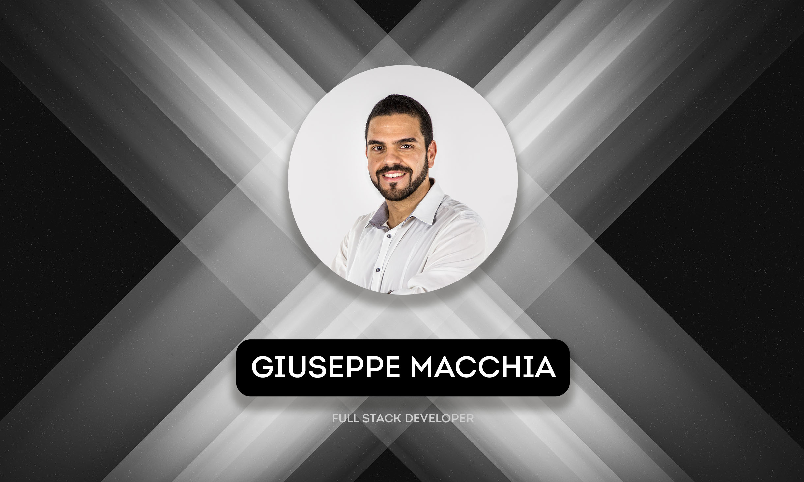

## Hello! I'm Giuseppe 👋 💻 📸📱

I'm a passionate Full Stack Developer. My expertise lies in using technologies like Angular and Ionic Capacitor to create engaging user interfaces, and in the backend, I favor Node.js and Spring Boot.
I am an enthusiastic advocate for Backend as a Service (BaaS), with a special affection for Parse Server.

## 👨🏻‍💻 Programming Languages

   
  
  
    
  
  

## 🚀 Framework and Libraries

  
  
    
  
  
    
    
   
  
  

## ☁️ Cloud Services

  
  
  

## 💾 Databases

  
  
  

## ⚙️ IDE & Editors

  
  
  
  
  

## 💌 Contact Me

